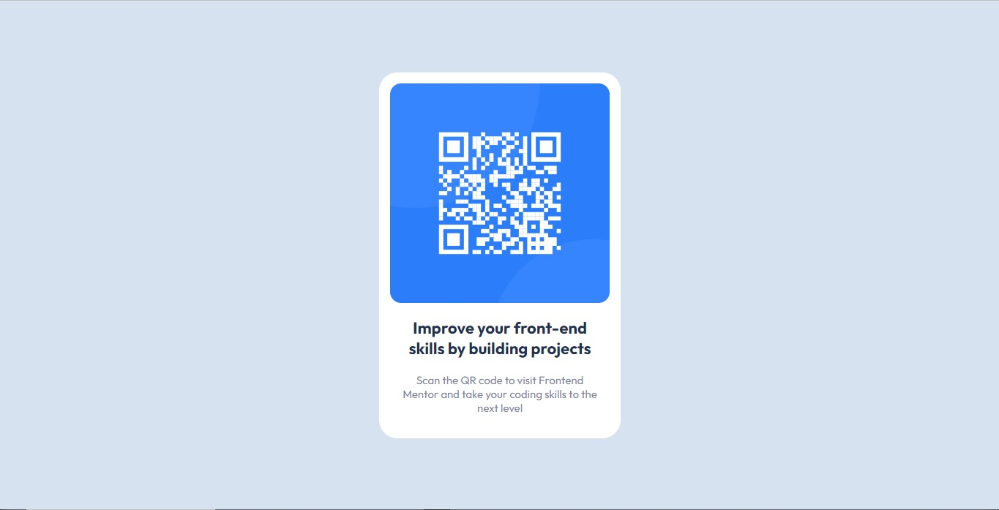

# Frontend Mentor - QR code component solution

This is a solution to the [QR code component challenge on Frontend Mentor](https://www.frontendmentor.io/challenges/qr-code-component-iux_sIO_H). Frontend Mentor challenges help you improve your coding skills by building realistic projects. 

## Table of contents

- [Overview](#overview)
  - [Screenshot](#screenshot)
  - [Links](#links)
- [My process](#my-process)
  - [Built with](#built-with)
  - [What I learned](#what-i-learned)
  - [Continued development](#continued-development)
  - [Useful resources](#useful-resources)
- [Author](#author)

**Note: Delete this note and update the table of contents based on what sections you keep.**

## Overview

### Screenshot




### Links

- Solution URL: [Add solution URL here](https://your-solution-url.com)
- Live Site URL: [Add live site URL here](https://your-live-site-url.com)

## My process

### Built with

- HTML5
- CSS
- Flexbox
- CSS Grid
- Mobile-first workflow
- [React](https://reactjs.org/) - JS library
- [Styled Components](https://styled-components.com/) - For styles

### What I learned

Use this section to recap over some of your major learnings while working through this project. Writing these out and providing code samples of areas you want to highlight is a great way to reinforce your own knowledge.

To see how you can add code snippets, see below:

This is my first project i make using React, so I learn everthing of React and JavaScript in this project.

```js
import './App.css';
import styled from 'styled-components'
import qr_code from './images/image-qr-code.png'

const Imagen = styled.img`
margin: 0 auto;
border-radius: 15px;
`;
```
```css
.proud-of-this-css {
  color: papayawhip;
}
```
I make to tutorials in the React website
```js
const products = [
  { title: 'Cabbage', isFruit:false, id: 1 },
  { title: 'Garlic', isFruit:false, id: 2 },
  { title: 'Apple', isFruit:true, id: 3 },
]

function MyButton({ count, onCLick }) {  
  return (
    <button onClick={onCLick}>
      Clicked {count} times
    </button>
  );
}
```

### Continued development

I like very much this project, I want learn more about React and CSS for one day I won a job of Web Developer or something similar. This project is ended i not contiueupgrading this project because I'll doing another project mayber better ou similar tho this.

### Useful resources

- [w3schools](https://www.w3schools.com) - This helped me for resolve somes problems for React and CSS
- [Quick Start React](https://beta.reactjs.org/learn) - This is an amazing article which helped me to make everthing.
- [Stackoverflow](https://stackoverflow.com) - I not need say nothing about this site all right. Help with everthing, everywhere.

## Author

- Website - [Joao Pedro Github](https://github.com/legonnexon)
- Frontend Mentor - [@legonnexon](https://www.frontendmentor.io/profile/legonnexon)
